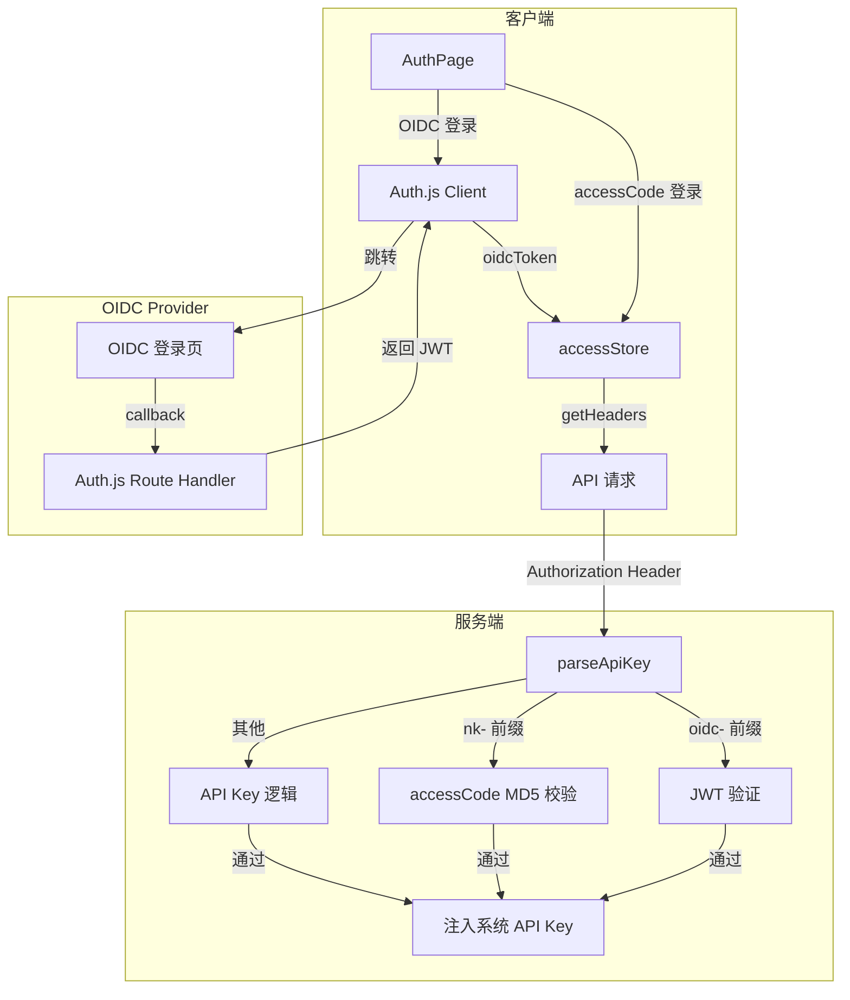

# 设计文档

## 1. 技术架构

### 1.1 技术选型

- 认证框架: Auth.js v5 (`next-auth@beta`)
- Session 模式: JWT (无数据库依赖)
- OIDC Provider: 标准兼容 (Keycloak / Casdoor / Auth0 等)
- 前端框架: 与项目现有 React + Next.js 一致
- 状态管理: Zustand (与项目现有 accessStore 一致)

### 1.2 系统架构



### 1.3 认证流程

**OIDC 登录流程:**
1. 用户点击 OIDC 登录按钮
2. 跳转到 OIDC Provider 登录页
3. Provider 认证成功后回调 `/api/auth/callback/oidc`
4. Auth.js 创建 JWT session，将 token 写入 accessStore.oidcToken
5. 后续 API 请求通过 `Authorization: Bearer oidc-{token}` 携带 token
6. 服务端 auth() 校验 JWT 签名和过期时间

**accessCode 登录流程 (不变):**
1. 用户输入 accessCode
2. API 请求通过 `Authorization: Bearer nk-{code}` 携带
3. 服务端 MD5 校验

## 2. 详细设计

### 2.1 新增文件

#### `app/api/auth/[...nextauth]/route.ts`
Auth.js Route Handler，配置 OIDC provider 和 credentials provider。

```ts
import NextAuth from "next-auth";
import oidc from "next-auth/providers/oidc";
import Credentials from "next-auth/providers/credentials";

export const { handlers, auth, signIn, signOut } = NextAuth({
  providers: [
    // 仅在 OIDC 环境变量配置时启用
    ...(process.env.OIDC_ISSUER
      ? [
          oidc({
            name: "SSO",
            issuer: process.env.OIDC_ISSUER,
            clientId: process.env.OIDC_CLIENT_ID!,
            clientSecret: process.env.OIDC_CLIENT_SECRET!,
          }),
        ]
      : []),
  ],
  session: {
    strategy: "jwt",
  },
  callbacks: {
    async jwt({ token, account }) {
      if (account) {
        token.accessToken = account.access_token;
        token.idToken = account.id_token;
      }
      return token;
    },
  },
  secret: process.env.NEXTAUTH_SECRET,
});

export const { GET, POST } = handlers;
```

#### `app/api/auth/session/route.ts`
获取当前 session 信息的端点，供客户端检查 OIDC 登录状态。

#### `middleware.ts`
Next.js Middleware，用于保护需要认证的页面路由（仅 OIDC 模式下生效）。

### 2.2 修改文件

#### `app/store/access.ts`
在 DEFAULT_ACCESS_STATE 中新增:
```ts
oidcToken: "",  // OIDC JWT session token
```

在 methods 中新增:
```ts
isValidOidc() {
  return validString(get().oidcToken);
}
```

修改 `isAuthorized()` 方法，增加 OIDC 判断:
```ts
isAuthorized() {
  // ... 现有判断
  || this.isValidOidc()
}
```

#### `app/client/api.ts`
修改 `getHeaders()` 函数，在 accessCode 判断之后增加 OIDC token 传递:
```ts
else if (validString(accessStore.oidcToken)) {
  headers["Authorization"] = getBearerToken(
    OIDC_TOKEN_PREFIX + accessStore.oidcToken,
  );
}
```

#### `app/api/auth.ts`
修改 `parseApiKey()` 函数，增加 `oidc-` 前缀识别:
```ts
const OIDC_TOKEN_PREFIX = "oidc-";

function parseApiKey(bearToken: string) {
  const token = bearToken.trim().replaceAll("Bearer ", "").trim();
  if (token.startsWith(ACCESS_CODE_PREFIX)) {
    return {
      accessCode: token.slice(ACCESS_CODE_PREFIX.length),
      apiKey: "",
      oidcToken: "",
    };
  }
  if (token.startsWith(OIDC_TOKEN_PREFIX)) {
    return {
      accessCode: "",
      apiKey: "",
      oidcToken: token.slice(OIDC_TOKEN_PREFIX.length),
    };
  }
  return { accessCode: "", apiKey: token, oidcToken: "" };
}
```

修改 `auth()` 函数，增加 OIDC token 校验:
```ts
if (oidcToken) {
  try {
    const decoded = await verifyOidcToken(oidcToken);
    return { error: false };
  } catch (e) {
    return { error: true, msg: "invalid OIDC token" };
  }
}
```

#### `app/components/auth.tsx`
在认证页面增加 OIDC 登录按钮:
- 通过服务端配置判断 OIDC 是否启用
- 按钮点击后调用 `signIn("oidc")` 跳转 Provider
- 登录成功回调后，将 token 存入 accessStore.oidcToken

#### `app/constant.ts`
新增常量:
```ts
export const OIDC_TOKEN_PREFIX = "oidc-";
```

#### `app/config/server.ts`
新增环境变量声明和配置读取:
```ts
OIDC_ISSUER?: string;
OIDC_CLIENT_ID?: string;
OIDC_CLIENT_SECRET?: string;
NEXTAUTH_SECRET?: string;

// 返回值中新增
isOidc: !!process.env.OIDC_ISSUER,
oidcIssuer: process.env.OIDC_ISSUER,
oidcClientId: process.env.OIDC_CLIENT_ID,
oidcClientSecret: process.env.OIDC_CLIENT_SECRET,
nextauthSecret: process.env.NEXTAUTH_SECRET,
```

#### `app/api/config/route.ts`
在返回给客户端的配置中增加 `isOidc` 标识。

### 2.3 Token 验证逻辑

新增 `app/utils/oidc.ts`，实现 OIDC token 服务端验证:
```ts
import jwt from "jsonwebtoken";

export async function verifyOidcToken(token: string) {
  // 从 OIDC_ISSUER 的 .well-known 获取公钥
  // 验证 JWT 签名、过期时间、issuer
  // 返回解码后的 payload
}
```

### 2.4 目录结构变化

```
app/
├── api/
│   └── auth/
│       ├── [...nextauth]/
│       │   └── route.ts        # 新增: Auth.js handler
│       └── session/
│           └── route.ts        # 新增: Session 查询端点
├── utils/
│   └── oidc.ts                 # 新增: OIDC token 验证工具
├── config/
│   └── server.ts               # 修改: 新增 OIDC 环境变量
├── store/
│   └── access.ts               # 修改: 新增 oidcToken 字段
├── client/
│   └── api.ts                  # 修改: getHeaders() 支持 OIDC
├── components/
│   └── auth.tsx                # 修改: OIDC 登录按钮
└── constant.ts                 # 修改: 新增 OIDC_TOKEN_PREFIX

middleware.ts                    # 新增: Next.js Middleware
```

## 3. 质量保证

### 测试策略
- 手动测试 OIDC 登录流程（需配置 OIDC Provider）
- 手动测试 accessCode 登录流程不受影响
- 验证 OIDC 未配置时，现有功能完全正常

### 安全考虑
- JWT 验证包含签名校验、过期检查、issuer 校验
- NEXTAUTH_SECRET 用于加密 JWT，必须配置
- OIDC token 不存储敏感用户信息，仅用于认证门禁

### 兼容性
- 未配置 OIDC 环境变量时，所有改动对现有功能零影响
- Tauri 桌面端暂时不启用 OIDC（保持 accessCode 方式）
- accessCode 认证路径完全保留